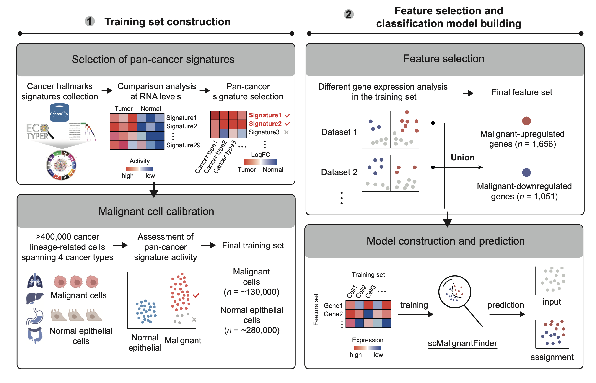

# scMalignantFinder: Malignant cell detection in cancer lineages at single-cell resolution

**scMalignantFinder** is a Python package designed for analyzing cancer single-cell RNA-seq datasets to distinguish malignant cells from their normal counterparts. Trained on over 400,000 high-quality single-cell transcriptomes, scMalignantFinder uses curated pan-cancer gene signatures for calibration and selects features by taking the union of differentially expressed genes across each dataset. For more details, please refer to the corresponding publication.



# Latest updates

## **Version 1.0.1 (2025-01-11)**

**Enhanced Flexibility for Test Input**

- Test data can now be provided as a path to an .h5ad file or directly as an AnnData object.

**Dynamic Feature Handling**

- During pretrained model usage, any missing features in the test dataset are temporarily filled with zeros during prediction to ensure compatibility.


## Version 1.0.0 2024-12-24

**New features**

- Introduced malignancy probability output

# Installation

We recommend using a conda environment to install scMalignantFinder.

1. Create and activate a conda environment

```bash
conda create -n scmalignant python=3.10.10
conda activate scmalignant
```

2. Install `scMalignantFinder` from PyPI:

```bash
pip install scMalignantFinder
```

Optional: scMalignantFinder includes a built-in pan-cancer cell type annotation tool, scATOMIC. If you want to perform basic cell type annotation before identifying malignant cells, follow the [scATOMIC official tutorial](https://github.com/abelson-lab/scATOMIC) to complete its installation in the same conda environment.

# Data preparation

A pretrained model and a list of ordered features are provided in the model directory. Users can also download or use the training data for training the model. 

1. **Training data**: Download the training data used in the original study from [here](http://home.ustc.edu.cn/~jonyyqn/scMalignantFinder_data/combine_training.h5ad), or use your own dataset to train the model.
2. **Feature file**: The feature list file can be collected from [here](http://home.ustc.edu.cn/~jonyyqn/scMalignantFinder_data/combined_tumor_up_down_degs.txt).
3. **Example test data**: 
   - Cancer cell line data containing malignant cells can be collected from [here](http://home.ustc.edu.cn/~jonyyqn/scMalignantFinder_data/test_cancerCellLine.h5ad).
   - Healthy tissue data containing normal epithelial cells can be collected from [here](http://home.ustc.edu.cn/~jonyyqn/scMalignantFinder_data/test_TabulaSapiens.h5ad).

# User guidance

```python
### Load package
from scMalignantFinder import classifier

# Initialize model
model = classifier.scMalignantFinder(
    test_input="path/to/test_data.h5ad",       # Path to test data or AnnData object
    pretrain_path=None, # Path to pretrained model
    train_h5ad_path="/path/to/train_data.h5ad",# Path to training data
    feature_path="/path/to/features.txt",     # Path to feature list
    model_method="RandomForest",              # ML method: LogisticRegression, RandomForest, XGBoost
    norm_type=True,                           # Normalize test data (default: True)
    n_thread=1,                               # Number of threads for parallel processing
    use_raw=False                             # Use .raw attribute of AnnData if available
)

# Load data
model.load()

# Predict malignancy
result_adata = model.predict()

# View results
print(result_adata.obs["scMalignantFinder_prediction"].head())

## Example output for scMalignantFinder_prediction:
Index
KUL01-T_AAACCTGGTCTTTCAT     Malignant
KUL01-T_AAACGGGTCGGTTAAC     Malignant
KUL01-T_AAAGATGGTATAGGGC      Normal
KUL01-T_AAAGATGGTGGCCCTA     Malignant
KUL01-T_AAAGCAAGTAAACACA     Malignant
Name: scMalignantFinder_prediction, dtype: category
Categories (2, object): ['Normal', 'Malignant']

print(result_adata.obs["malignancy_probability"].head())
## Example output for malignancy_probability:
Index
KUL01-T_AAACCTGGTCTTTCAT     0.98578
KUL01-T_AAACGGGTCGGTTAAC     0.78968
KUL01-T_AAAGATGGTATAGGGC      0.243564
KUL01-T_AAAGATGGTGGCCCTA     0.8796
KUL01-T_AAAGCAAGTAAACACA     0.6598
Name: malignancy_probability
```


# Citation

If you use scMalignantFinder in your research, please cite the corresponding publication.
