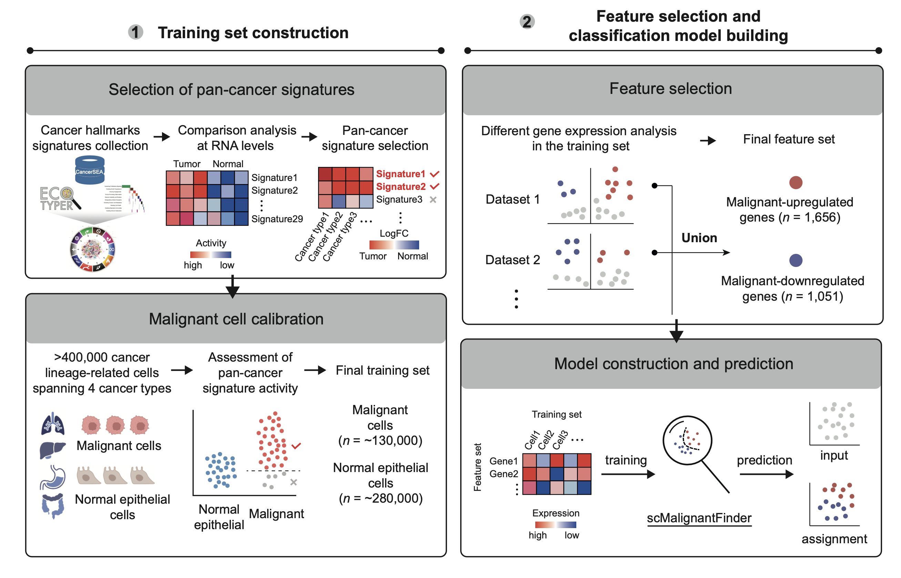

[](https://pypi.org/project/scMalignantFinder)
[](https://pepy.tech/project/scMalignantFinder)
[](https://github.com/Jonyyqn/scMalignantFinder/stargazers)

# scMalignantFinder: Distinguishing malignant cells in single-cell and spatial transcriptomics using cancer signatures



**scMalignantFinder** is a Python package for identifying malignant cells in cancer single-cell RNA-seq and spatial transcriptomics data. It was trained on more than 400,000 high-quality single-cell transcriptomes and leverages curated pan-cancer gene signatures to distinguish malignant cells from their normal counterparts. The package also provides downstream utilities for malignant region identification in spatial data and cancer cell state analysis using curated gene sets.

## Contents

<!-- START doctoc generated TOC please keep comment here to allow auto update -->

<!-- DON'T EDIT THIS SECTION, INSTEAD RE-RUN doctoc TO UPDATE -->

- [Latest updates](#latest-updates)
- [Installation](#installation)
- [Data preparation](#data-preparation)
- [User guidance](#user-guidance)
  - [Identify malignant cells from scRNA-seq data](#identify-malignant-cells-from-scrna-seq-data)
  - [Identify malignant regions from spatial transcriptomics](#identify-malignant-regions-from-spatial-transcriptomics)
  - [Analyze cancer cell states using curated gene sets](#analyze-cancer-cell-states-using-curated-gene-sets)

<!-- END doctoc generated TOC please keep comment here to allow auto update -->

## Latest updates

### Version 1.1.9 (2025-05-27)
- Added a new module for downstream cancer cell state analysis.

### Version 1.1.6 (2025-04-26)
- Expanded input support for test data to include `.txt`, `.tsv`, `.csv`, and their compressed `.gz` versions.

### Version 1.1.5 (2025-04-20)
- Added malignant region identification for spatial transcriptomics data using a clustering-based strategy.

### Version 1.0.5 (2025-01-11)
- Added support for using either an `.h5ad` file path or an `AnnData` object as test input.

### Version 1.0.0 (2024-12-24)
- Introduced malignancy probability output.

## Installation

We recommend installing `scMalignantFinder` in a dedicated conda environment.

### Option A: Create an environment manually and install from PyPI (recommended)

1. Create and activate a conda environment:

```bash
conda create -n scmalignant python=3.10.10
conda activate scmalignant
```

2. Install `scMalignantFinder` from PyPI:

```bash
pip install scMalignantFinder
```

### Option B: Install with `environment.yml`

If you prefer, you can create the conda environment directly from the provided `environment.yml` file:

```bash
conda env create -f environment.yml
conda activate scmalignant
```

> [!NOTE]
> `scMalignantFinder` includes optional support for pan-cancer cell type annotation through **scATOMIC**. If you would like to perform basic cell type annotation before malignant cell identification, please follow the [official scATOMIC tutorial](https://github.com/abelson-lab/scATOMIC) and install it in the same conda environment.

## Data preparation

All resources required for `scMalignantFinder` have been deposited on [Zenodo](https://zenodo.org/records/17888140) for stable long-term access, including pretrained models, training data, example test datasets, and feature files.

### Required resources for pretrained inference

Download the following files and place them in the same directory:

- Pretrained model: [model.joblib](https://zenodo.org/records/17888140/files/model.joblib)
- Ordered feature list: [ordered_feature.tsv](https://zenodo.org/records/17888140/files/ordered_feature.tsv)

Example directory structure:

```text
pretrained_model/
├── model.joblib
└── ordered_feature.tsv
```

### Resources for model training

If you would like to train a model from scratch, the following files are available:

1. **Training data**: [combine_training.h5ad](https://zenodo.org/records/17888140/files/combine_training.h5ad)
2. **Feature list**: [combined_tumor_up_down_degs.txt](https://zenodo.org/records/17888140/files/combined_tumor_up_down_degs.txt)

You may also use your own training dataset and feature list if you want to build a custom model.

### Example test datasets

The following example datasets are provided for quick testing:

- Malignant cells from a cancer cell line: [test_cancerCellLine.h5ad](https://zenodo.org/records/17888140/files/test_cancerCellLine.h5ad)
- Normal epithelial cells from healthy tissue: [test_TabulaSapiens.h5ad](https://zenodo.org/records/17888140/files/test_TabulaSapiens.h5ad)

### Resource for spatial region identification

For malignant region identification in spatial transcriptomics data, the malignant cell gene signature file is available here:

- [sc_malignant_deg.gmt](https://zenodo.org/records/17888140/files/sc_malignant_deg.gmt)

You may also provide your own gene signature file, as long as it follows the same `.gmt` format.

## User guidance

### Identify malignant cells from scRNA-seq data

`scMalignantFinder` supports two usage modes:

1. **Use a pretrained model** (**recommended for most users**)
2. **Train a model from scratch**

For most users, the pretrained model is the simplest and most convenient option.

#### Input requirements

`test_input` can be:

- an `AnnData` object
- a path to a `.h5ad` file
- a path to a tab-delimited `.txt` or `.tsv` file
- a path to a comma-delimited `.csv` file
- gzipped versions of the above text files (`.txt.gz`, `.tsv.gz`, `.csv.gz`)

For text-based files:

- **rows** must correspond to **gene symbols**
- **columns** must correspond to **cell barcodes**

> [!TIP]
> We recommend running `scMalignantFinder` on a biologically relevant subset of cells. For example, if the tumor is known to originate from epithelial cells, you may first subset your dataset to epithelial cells before prediction.

#### Option 1: Use a pretrained model (recommended)

Prepare a directory containing:

- `model.joblib`
- `ordered_feature.tsv`

For example:

```text
pretrained_model/
├── model.joblib
└── ordered_feature.tsv
```

Then run:

```python
from scMalignantFinder import classifier

model = classifier.scMalignantFinder(
    test_input="path/to/test_data.h5ad",
    pretrain_dir="path/to/pretrained_model",
    norm_type=True,
    n_thread=1
)

model.load()
result_adata = model.predict()
```

> [!NOTE]
> If `pretrain_dir` is provided, the pretrained model and feature list are loaded automatically. In this case, `train_h5ad_path` and `feature_path` are not required.

#### Option 2: Train a model from scratch

Use this mode only if you want to train your own classifier.

```python
from scMalignantFinder import classifier

model = classifier.scMalignantFinder(
    test_input="path/to/test_data.h5ad",
    train_h5ad_path="path/to/train_data.h5ad",
    feature_path="path/to/combined_tumor_up_down_degs.txt",
    model_method="LogisticRegression",
    norm_type=True,
    n_thread=1
)

model.load()
result_adata = model.predict()
```

If training from scratch, the training `.h5ad` file must contain labels in:

```python
adata.obs["Raw_annotation"]
```

Supported labels are:

- `"Normal"`
- `"Malignant"`
- `"Tumor"`

Both `"Malignant"` and `"Tumor"` are treated as malignant during training.

#### Parameter notes

- `pretrain_dir`: directory containing `model.joblib` and `ordered_feature.tsv`
- `train_h5ad_path`: required only when training from scratch
- `feature_path`: required only when training from scratch
- `model_method`: one of `"LogisticRegression"`, `"RandomForest"`, or `"XGBoost"`
- `norm_type=True`: applies `sc.pp.normalize_total(adata, target_sum=1e4)` to the input data
- `norm_type=False`: skips normalization
- `n_thread`: number of threads used by the classifier
- `use_raw=True`: uses `adata.raw.X` as input, if available

> [!IMPORTANT]
> `scMalignantFinder` does **not** perform log-transformation internally. If your input data has already been normalized, set `norm_type=False`.

#### View results

After prediction, two columns are added to `result_adata.obs`:

- `scMalignantFinder_prediction`: predicted label (`"Normal"` or `"Malignant"`)
- `malignancy_probability`: predicted probability of being malignant

```python
print(result_adata.obs["scMalignantFinder_prediction"].head())
```

Example output:

```text
KUL01-T_AAACCTGGTCTTTCAT    Malignant
KUL01-T_AAACGGGTCGGTTAAC    Malignant
KUL01-T_AAAGATGGTATAGGGC    Normal
KUL01-T_AAAGATGGTGGCCCTA    Malignant
KUL01-T_AAAGCAAGTAAACACA    Malignant
Name: scMalignantFinder_prediction, dtype: category
Categories (2, object): ['Normal', 'Malignant']
```

```python
print(result_adata.obs["malignancy_probability"].head())
```

Example output:

```text
KUL01-T_AAACCTGGTCTTTCAT    0.985780
KUL01-T_AAACGGGTCGGTTAAC    0.789680
KUL01-T_AAAGATGGTATAGGGC    0.243564
KUL01-T_AAAGATGGTGGCCCTA    0.879600
KUL01-T_AAAGCAAGTAAACACA    0.659800
Name: malignancy_probability, dtype: float64
```

### Identify malignant regions from spatial transcriptomics

Based on the malignancy probability generated in the previous step, `scMalignantFinder` can further identify malignant regions in spatial transcriptomics data by integrating transcriptomic signatures and image-derived features.

A typical workflow is:

1. Calculate AUCell scores using a malignant gene signature
2. Extract image-based features from the spatial image
3. Integrate these features to identify malignant regions

```python
from scMalignantFinder import spatial, utils

# Step 1: Calculate AUCell scores using scRNA-seq-derived gene sets
sc_gmt = "./model/sc_malignant_deg.gmt"
adata = utils.aucell_cal(adata, sc_gmt)

# Step 2: Extract image-based features
adata = spatial.image_cal(adata)

# Step 3: Integrate multi-modal features to identify malignant regions
adata = spatial.region_identification(
    adata,
    features=["malignancy_probability", "Malignant_up", "image_score"],
    nclus=3,
    define_feature="Malignant_up",
    spatial_nn=True
)
```

#### Key arguments

- `features`: columns in `adata.obs` used for clustering
- `nclus`: number of clusters to define during hierarchical clustering
- `define_feature`: feature used to determine which cluster corresponds to malignant regions
- `spatial_nn=True`: refines region labels using spatial neighborhood information

#### View results

```python
print(adata.obs[["cluster", "region_prediction"]].head())
```

Example output:

```text
                   cluster region_prediction
AAACAAGTATCTCCCA-1       0            Normal
AAACACCAATAACTGC-1       1         Malignant
AAACAGAGCGACTCCT-1       2            Normal
AAACAGGGTCTATATT-1       0            Normal
AAACAGTGTTCCTGGG-1       1         Malignant
```

### Analyze cancer cell states using curated gene sets

To support downstream functional interpretation, `scMalignantFinder` includes access to **[67 curated cancer cell state gene sets](https://zenodo.org/records/17888140/files/Malignant_MPs.Gavish_2023.gmt)** collected from [a pan-cancer study](https://doi.org/10.1038/s41586-023-06130-4). These gene sets capture a broad range of cancer-associated cellular programs, including cell cycle, EMT, immune evasion, and hypoxia.

You can quantify the enrichment of these gene sets in individual cells using AUCell scoring:

```python
from scMalignantFinder import utils

# Path to the curated pan-cancer gene sets
pan_cancer_gene_sets = "/path/to/model/Malignant_MPs.Gavish_2023.gmt"

# Compute AUCell scores for each gene set
adata = utils.aucell_cal(adata, pan_cancer_gene_sets, norm_type=False)

# View results
print(adata.obs.loc[:, adata.obs.columns.str.startswith("MP")].iloc[:5, :3])
```

Example output:

```text
                MP1 Cell Cycle - G2/M  MP2 Cell Cycle - G1/S  MP3 Cell Cylce HMG-rich
KUL01-T_AAACCT               0.045819               0.000000                  0.306887
KUL01-T_AAACGG               0.155027               0.078003                  0.227548
KUL01-T_AAAGAT               0.000000               0.000000                  0.293480
KUL01-T_AAAGAG               0.000000               0.000000                  0.239118
KUL01-T_AAAGCA               0.068728               0.000000                  0.272176
```

## Citation

If you use `scMalignantFinder` in your research, please cite:

Yu, Qiaoni, Yuan-Yuan Li, and Yunqin Chen. *scMalignantFinder distinguishes malignant cells in single-cell and spatial transcriptomics by leveraging cancer signatures*. Communications Biology, 2025.

DOI: [https://doi.org/10.1038/s42003-025-07942-y](https://doi.org/10.1038/s42003-025-07942-y)

```bibtex
@article{yu2025scmalignantfinder,
  title={scMalignantFinder distinguishes malignant cells in single-cell and spatial transcriptomics by leveraging cancer signatures},
  author={Yu, Qiaoni and Li, Yuan-Yuan and Chen, Yunqin},
  journal={Communications Biology},
  volume={8},
  number={1},
  pages={504},
  year={2025},
  publisher={Nature Publishing Group UK London}
}
```
